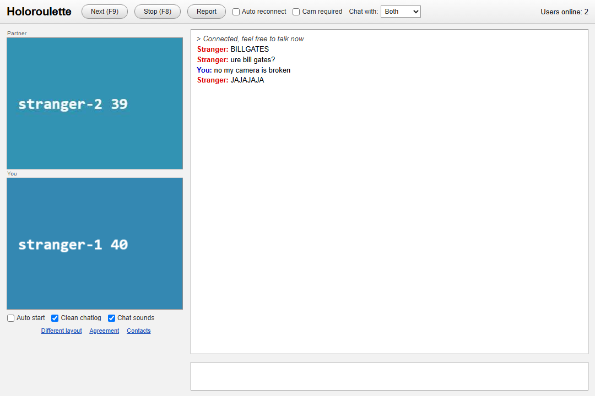
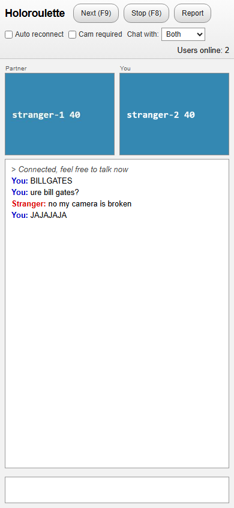

# Holoroulette

**Talk to a random stranger.** The 2010 roulette, reborn with **no server behind it** —
on the Hologram κ fabric.

**Live: <https://humuhumu33.github.io/holoroulette/>** — open it on two devices and they
pair with no infrastructure in between.



The original page was one full-page Flash movie (Arial, white bg, the painted gray
chrome) — this chrome matches what that movie painted, minus its ad line. On a phone the
same page folds to one column: the two pictures side by side, the chat breathing below.




Open the page, and you are on the wheel. `Next (F9)` spins to a new stranger, `Stop (F8)`
steps off, the chat says **Stranger:** in red and **You:** in blue, and the log still says
the words: *Connected, feel free to talk now.* The chrome, the pills, the Partner/You
stack, the little checkboxes — the whole 2010 feeling, kept.

What changed is everything underneath.

## No croupier

The original needed a matchmaking server, and the modern clones need SFUs. Here there is
**nobody in the middle at all**:

- **The lobby is a door, not a server.** Presence and seeking are sealed AES-GCM frames on
  an unguessable derived topic over free public MQTT brokers (raced, deduped — the
  televoid / Hologram Meet broker-door pattern). The broker routes ciphertext it cannot
  read, on infrastructure nobody here operates. `Users online: N` is counted from
  presence beacons, not asked of a backend.
- **The wheel spins itself.** Pairing is decided by the players, deterministically: a
  seeking stranger hears another seek, the lower id offers a freshly minted 128-bit room
  secret, the other accepts — mutual, disjoint, coordinator-free. The wheel never lands
  on the stranger you just left (checked in both directions), a lost accept times out and
  respins, a stale accept gets a `sorry` so nobody is ever left waiting on a ghost.
- **The pair is a fabric, not a call.** The room secret derives a private door (SDP/ICE
  only) and a private AES key. Every unit between the two strangers — a chat line, a
  typing beacon, a video frame, the goodbye — crosses as the **same thing**: a
  κ-addressed, end-to-end-encrypted object on [`holo-fabric`](vendor/holo-fabric.mjs)
  (vendored verbatim from hologram-apps — see [PROVENANCE](vendor/PROVENANCE.md)).
  The receiver re-derives the κ of every object and drops what fails. No WebRTC media
  stack, no tracks, no SFU — the byte pipe under the fabric is a single data channel,
  and the fabric doesn't care what it is (that's the fabric's transport waist).
- **Infinitely scalable by shape.** Every pair is its own two-node fabric on its own
  key and its own topic. Ten strangers or ten million: no shared hot path exists to
  saturate — the only shared thing is the content-blind lobby topic carrying tiny
  sealed beacons.

Video is the honest 2010 cadence: ~8 fps JPEG frames, 320×240 — each frame one verified
κ-object. It looks like Chatroulette because that *is* what Chatroulette looked like.

## Run it

No build, no dependencies, no server. Serve the folder statically (or use the tiny local
host below) and open `web/index.html` in two browsers:

```
node witness/signal-relay.mjs 8080        # local demo host (adds a relay door for offline dev)
# then open two tabs:  http://127.0.0.1:8080/web/index.html
```

Served from *any* static origin, the page uses the public broker door — two devices
anywhere in the world pair with no infrastructure of ours in between.

**Chat with: Humans · AI · Both** — the header chooser routes the wheel. Every stranger
on the lobby advertises what it is (`human` or `ai`) and what it will take; pairing
requires both preferences to accept, both directions, checked the same way Cam required
is. An AI person joins the SAME page with `?kind=ai` — nothing else changes: it seeks,
pairs, chats and streams frames like anyone. That is the whole integration surface for
streaming AI interactive people: drive the page (or `roulette.mjs` + `session.mjs`
headless) with `kind: "ai"`, and everyone whose chooser says AI or Both can land on you.
Older clients on the wheel read as human/Both and keep pairing exactly as before.

Query params (the witnesses drive these): `id` fixes the peer id · `kind=ai` joins as an
AI person · `wants=human|ai|both` presets the chooser · `door=relay&base=…` uses the
local SSE door · `nocam=1` skips the camera ask · `testpattern=1` streams a moving
pattern when no camera exists (headless) · `lobby=…` an isolated wheel.

## Witnesses

The product path is the tested path — the witnesses drive `web/index.html` itself.

```
node witness/match.witness.mjs    # PURE   18/18 — the wheel in node over jittered mem doors, incl. Humans/AI/Both routing
node witness/ux.witness.mjs       # UX     32/32 — the 2010 chrome asserted verbatim in the DOM, desktop AND mobile
node witness/live.witness.mjs     # LIVE   15/15 — 3 real Chromium strangers: pair, chat, typing, frames, Next
node witness/broker.witness.mjs   # BROKER  4/4 — the production door: pair + chat + frames over the REAL public brokers
```

All green 2026-08-29 (69/69). The broker witness exists because of a live-caught hang:
a frame posted before the MQTT socket finished its handshake was silently dropped —
taking the pair's first SDP offer with it, a state ICE restart cannot escape. The door
now queues until it can speak, and that witness holds the door shut against regression. Playwright resolves from the hologram workspace next door;
`npm i playwright` anywhere on the resolve path works too.

## The shape of the code

```
web/index.html      the page — the whole product, one file of chrome + glue
web/roulette.mjs    the wheel: presence, seek/offer/accept/sorry — DOM-free, RTC-free (node-testable)
web/session.mjs     the pair: private door + pair key + fabric over one data channel
web/broker-door.mjs the serverless door: sealed frames over raced public MQTT brokers
web/wire.mjs        one framing for every object: [hdrLen | hdr JSON | body]
web/strings.mjs     the voice of the room, asserted by the UX witness
vendor/             holo-fabric.mjs, verbatim (never fork here — upstream is canonical)
witness/            the three suites + the local relay + the press-photo script
```

Report has no one to report to — there is no server to receive it. It disconnects and
spins on; real moderation on a serverless wheel is an open, honest gap (a signed
strike strand shared between peers would be the κ-native shape of it).

MIT. Built on the televoid stack ([humuhumu33/televoid](https://github.com/humuhumu33/televoid)).
